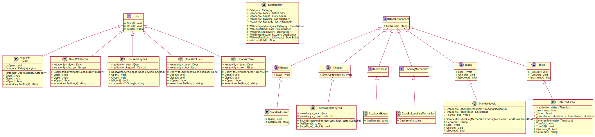

# Doors
A small repository demonstrating OOP principles and the **decorator** design pattern.

### Requirements
.NET 5

### Overview

The **Doors** project is a small library consisting of various door components 
that can be put together into a Door object with the desired functionality. 

A Door can be opened and closed. By using the decorator pattern additional behaviour 
can be added to the door at runtime by continuously wrapping multiple door objects:
```C#
IDoor door = new Door(Category.Security);
door = new DoorWithLock(door, doorLock);
door = new DoorWithSiren(door, siren);

door.Open(); // Will call DoorWithSiren#Open -> DoorWithLock#Open -> Door#Open
```

The DoorBuilder abstracts the creation into a simple fluid syntax. 
For example the following code snippet creates a Front Door with two different locks, 
a buzzer that makes a sound when opened and a siren that will start 
alarming if the door stays open for 30 seconds:
```C#
var door = new DoorBuilder()
                .WithCategory(Category.Front)
                .WithLock(new StandardLock(new DeadBoltLockingMechanism(), new AssaLockHouse()))
                .WithLock(new StandardLock(new DeadBoltLockingMechanism(), new AssaLockHouse()))
                .WithBuzzer(new StandardBuzzer())
                .WithSiren(new DeferredSiren(TimeSpan.FromSeconds(30)))
                .Build();
```


The **Doors.Main** project demonstrates further use of the **Doors** library
and shows how it can be extended with new functionality.

UML diagram of the library:



